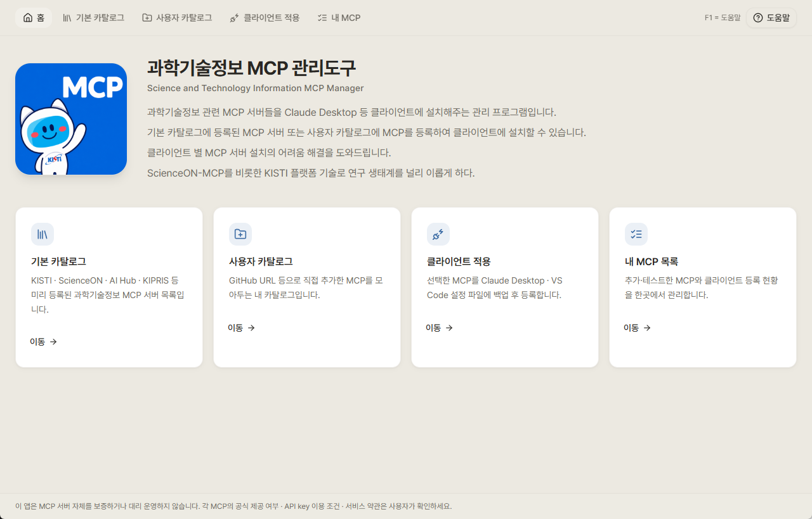
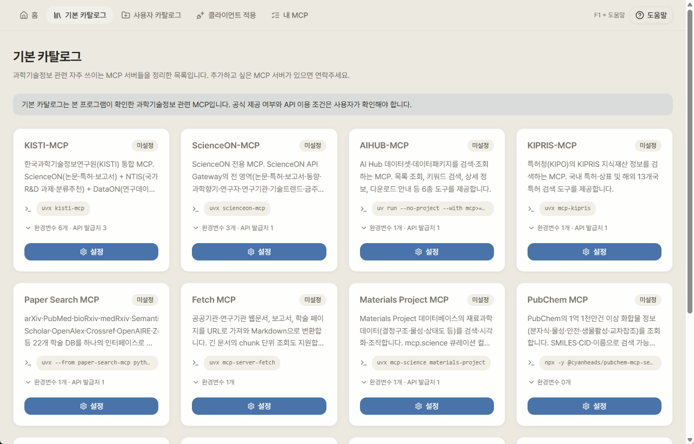

# 과학기술정보 MCP 관리도구 (STIMCP-Manager)

**S**cience and **T**echnology **I**nformation **MCP** **Manager**

과학기술정보 관련 MCP 서버를 기본 카탈로그에서 선택 또는 GitHub URL로 추가하고, 동작 테스트 후 Claude Desktop · VS Code 등 클라이언트에 설치해주는 관리 프로그램입니다. 클라이언트 별 MCP 서버 설치를 어려워하는 사용자는 관리도구로 등록해서, 쓰기만 하세요. 

- 앱 ID: `kr.kisti.stimcpmanager` (exe: `stimcp.exe`)
- 지원 OS: **Windows 10/11 (x64)** — Windows 11 권장
- 버전: `v0.1.1`
- 상태: **MVP** — 아래 주요 기능이 동작합니다.

## 주요 기능

| 메뉴 | 기능 |
|---|---|
| **기본 카탈로그** | KISTI · ScienceON · AI Hub · KIPRIS 등 미리 정리된 MCP를 골라 환경변수 입력 후 내 목록에 추가 |
| **사용자 카탈로그** | GitHub URL로 MCP를 추가 (`git clone` 후 폼 자동 채움), 동작 테스트(`initialize` + `tools/list`) |
| **클라이언트 적용** | 선택한 MCP를 Claude Desktop · VS Code 설정 파일에 등록 (등록 전 자동 백업 · 중복 감지) |
| **내 MCP** | 각 클라이언트 설정 파일을 직접 읽어 현재 설치된 MCP 표시 · 보기 · 복원 · 초기화 · 개별 삭제 |

- `F1` 키로 도움말 모달을 엽니다.
- API key 등 민감 정보는 화면·로그에서 마스킹되며, 설정 파일에는 클라이언트 호환을 위해 평문 저장됩니다.

## 화면 미리보기

**홈**

**기본 카탈로그**

## 다운로드 & 실행 (사용자용)

개발 환경 없이 바로 쓰려면 [**Releases**](../../releases) 페이지에서 최신 실행 파일을 내려받으세요.

| 파일 | 설명 |
|---|---|
| `stimcp_portable.exe` | **포터블** 단일 실행 파일. 설치 없이 더블클릭으로 실행. |
| `STIMCP-Manager_0.1.1_x64-setup.exe` | **설치형(NSIS)**. 시작 메뉴·바탕화면 아이콘을 자동 등록. (초보자 권장) |
| `STIMCP-Manager_0.1.1_x64_en-US.msi` | **설치형(MSI)**. 기업 배포·그룹 정책 환경에 적합. |

### 실행 전 확인 (Windows)

1. **WebView2 Runtime 필요**
   이 앱은 Windows의 WebView2 런타임을 사용합니다.
   - Windows 11 및 최신 Windows 10 → 이미 설치되어 있어 바로 실행됩니다.
   - 실행 시 빈 흰 창이 뜨거나 실행이 안 되면 [WebView2 Runtime](https://developer.microsoft.com/microsoft-edge/webview2/)(Evergreen Standalone Installer)을 설치하세요.

2. **"Windows의 PC 보호" 경고가 떠도 정상입니다**
   서명되지 않은 내부 배포 파일이라 SmartScreen 경고가 표시됩니다.
   → **추가 정보**(More info) 클릭 → **실행**(Run anyway) 버튼을 누르면 실행됩니다.

3. **설정 저장 위치**
   추가·등록한 MCP 정보는 `%APPDATA%\kr.kisti.stimcpmanager\user_mcps.json`에 저장됩니다. (USB 무흔적 포터블이 아니라, 실행 PC에 설정이 남습니다.)

## 관련 링크

- [ScienceON](https://scienceon.kisti.re.kr?utm_source=stimcp-manager) :  KISTI 과학기술정보 지식인프라(논문·특허·보고서·연구데이터)
- [KISTI 한국과학기술정보연구원](https://www.kisti.re.kr?utm_source=stimcp-manager)

## 라이선스 / 고지

- 본 프로그램은 **누구나 무료로 내려받아 사용할 수 있는 프리웨어(freeware)** 입니다. 소스코드는 공개하지 않습니다. © 2026 한국과학기술정보연구원(KISTI) 연구지능화센터 서비스지능화팀.
- **재배포는 자유롭게 허용**하되, 반드시 **원본 실행 파일을 변형 없이 그대로** 배포해야 하며(악성코드 삽입·리패키징 등 변조 금지) **출처(KISTI) 표시를 유지**해야 합니다.
- 소프트웨어는 **"있는 그대로(as-is)"** 제공되며, 사용으로 발생하는 어떠한 결과에 대해서도 보증·책임을 지지 않습니다.
- 본 프로그램은 Tauri · React 등 오픈소스 컴포넌트를 포함하며, 각 구성요소는 해당 오픈소스 라이선스를 따릅니다.
